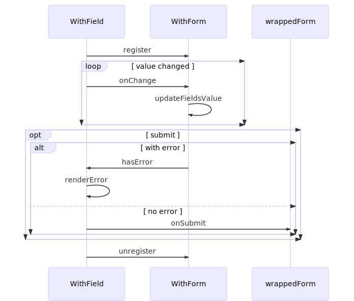

## Patterns continue
---
### Form Pattern
Lighter version of *Redux-form*
+++
@snap[north-west]
@size[1.5em](Pros)
@snapend

@snap[north-east]
@size[1.5em](Cons)
@snapend

@snap[west pros-details]
@ol
- Decouple UI components with form logic. 
- Dynamic composition and reusable.
- Trackable data in redux store, but not coupled with redux.
- Build-in Automatic and flexible caching.
@olend
@snapend

@snap[east cons-details]
@snap[fragment]

@snapend
@snapend

+++
### Form Sequence
@snap[mid-point form]

@snapend
---
### WithForm
**FormOptions**
@ul
- *formValidator()*
- *defaultValues(props)*
- *autoClearFormData*
- *disableFormData*
@ulend
+++
#### Code implementation
---?code=assets/withForm.js&lang=javascript
@[68-81](Initialize child context functions)
@[104-110](`register`)
@[112-114](`unregister`)
@[116-119](initialize form value)
@[140-146](update cache whenever changed)
@[174-195](handle submit)
@[94-99](clean form data if cache disabled)
+++
#### Typical Usage
```javascript
export default withForm({
  formValidator: paymentFormValidator,
  autoClearFormData: true,
  defaultValues: (props: Props) => {
    const {formData, savedCreditCards, shouldShowChaseInstantCreditCard, shouldShowPayPal} = props;
    const hasAlreadySelectedCreditCard = !!_.get(formData, 'selectedCardId');
    const selectedCardId = hasAlreadySelectedCreditCard ? formData.selectedCardId : getDefaultValueForSelectedCreditCard(savedCreditCards, shouldShowChaseInstantCreditCard, !shouldShowPayPal);
    return {
      selectedCardId,
      isoCountryCode: 'US',
      phoneCountryCode: 'US',
      chasePhoneCountryCode: 'US'
    };
  }
})(PaymentForm);
```
---
### WithField
+++
**Parameters**
@ul
- *parse()*
- *format()* 
@ulend
+++
#### Code implementation
---?code=assets/withField.js&lang=js
@[40-43](`register`)
@[45-48](`unregister`)
@[50-55](triggers form change)
@[57-80](render)
+++
---
### WithFields
---
### Cache
@ul
- Form values will be automatically cached in Redux tree if it's been changed by user.
- You can trigger redux action to save whatever form value if you want
- *autoClearFormData* setting to true means clear the form data when we submit the form.
- *disableFormData* setting to true means disable form cache by default.
@ulend
---
### Form&Field props
- every form needs a unique form id.
- every field needs a unique name.
- use *initialFormData* to pre-fill form.
---
### DefaultValues
- *initialFormData* could be passed as part of props to the form to set up initialValue.
- cache of the form > *initialFormData* > *defaultValues(props)*
---

### Interceptors pattern
---
### Graph
@snap[mid-point interceptor]

@snapend
---
**Global-wised interceptor**
@ul
- `removePromoQueryInterceptor`
  - Typical scenario: Clearing analytics tracking parameters.
- `forceRedirectToHomeInterceptor`
  - Typical scenario: Protect unsafe url.
- `forceRedirectInterceptor`
  - Typical scenario: Forbid user back between each of the flow.
- `addForceRedirectFlagInterceptor`
  - Typical scenario: Click back on end of each flow.
@ulend
+++
**Flow-wised interceptor**
- Flow
  - Entry and Exit
  - Status
    - initial
    - in_progress
    - completed
+++
**Refresh inside a flow will trigger *redirectFlowInterceptor***
@ul
- status === inital && !entry => entry
- status === in_progress && !exit=> home
- status === completed && !exit => home
- exit => home
- !entry => entry 
@ulend
+++
**Entering flow transition triggers *cleanFlowInterceptor***
@ul
- *flowCleaner* exists
- Transit to entry from outside of the flow
@ulend
+++
**Back on not-allowed-to-back path will trigger *forceBackToHomeInterceptor***
@ul
Session expired demo
@ulend
---
## Thanks!

