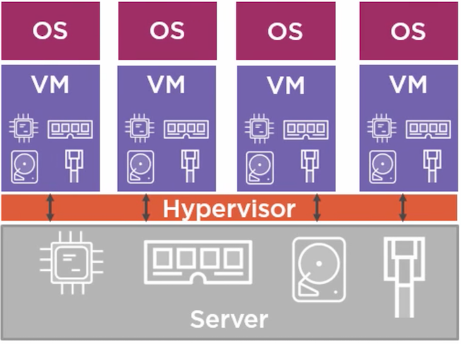
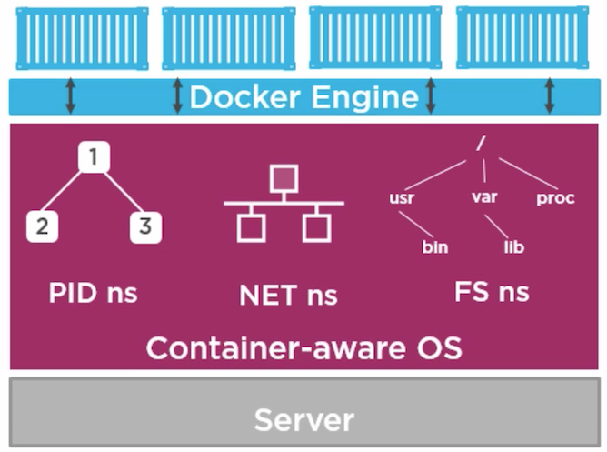

# A Glance At Containers
---

### What is containers
* Traditional VMs  


---

* Containers are lightweight than VMs with all instances sharing OS module using namespace.


--- 

### Why use containers
- Consistency across development, testing, and production environments.
- Loose coupling between application and operating system layers
- Workload migration simplified between on-premises and cloud environments
- Agility: agile development and operations

--- 

### Docker

--- 

#### Start with `docker run` command.

``` shell
docker run hello-world
```

--- 

#### Theory of Pulling and Running containers

--- 

#### Working with images

--- 

#### Container Lifecycle

--- 

### Docker usage in mWeb

--- 

#### Development CHAPI servers on MacOS
* Understand docker volumes.

--- 

#### Sonar cube

--- 

#### Jenkins instance

--- 

### Container orchestration
### Kubernetes
> *Pod*:   
> A group of containers that are deployed together, with guaranteed network access.  
> Help developers build modularly  
* Kubernetes eases application management
	* Workload portability
	* Persistent storage
	* Rolling updates
* Kubernetes makes applications more elastic
	* Multi-zone clusters
	* Load balancing
	* Autoscaling
#Cloud #Container #Docker
