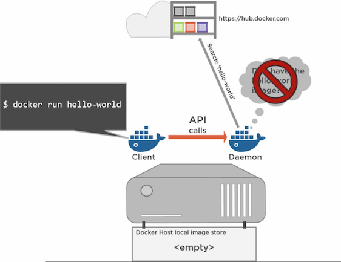
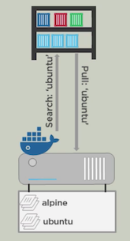
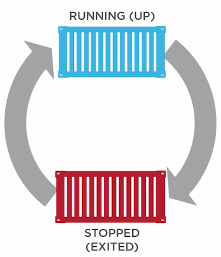

# A Glance At Containers
---

### What is container
* Traditional VMs  


---

* Containers are lightweight than VMs with all instances sharing OS module using namespace.


--- 

### Docker

--- 

#### Start with docker run command.

``` shell
docker run hello-world:latest
```

+++

#### Theory of Pulling and Running containers



--- 

#### Highlights.

* *docker run* to run a new container
* *docker ps* to see running and stopped containers
* *docker images* to see info about images
* *docker logs* to check the log of images

--- 

#### Containers and images

- Images ~ Stopped containers

- Containers ~ Running images

+++ 

`docker pull ubuntu:latest`


--- 

#### Container Lifecycle

`docker start <container>` 



`docker stop <container>` 

+++

#### Highlights.

* *docker start `<container>`* to start
* *docker stop `<container>`* to stop
* *docker rm `<container>`* to remove the container
* *docker rmi `<image>`* to remove the image

--- 

#### Build a simple container by ourselves

> Dockerfile
```
#Simple web server
FROM ubuntu:16.04
RUN apt-get update && apt-get install -y apache2 && rm -rf /var/cache/apt-get/*
EXPOSE 80
CMD [ "apache2ctl", "-D", "FOREGROUND"]
```

---

### Why use containers
- Consistency across development, testing, and production environments.
- Loose coupling between application and operating system layers
- Workload migration simplified between on-premises and cloud environments
- Agility: agile development and operations

--- 

### Docker usage in mWeb

--- 

#### Sonar cube

--- 

#### Jenkins instance

--- 

#### Development CHAPI servers on MacOS
* Understand docker volumes.

--- 